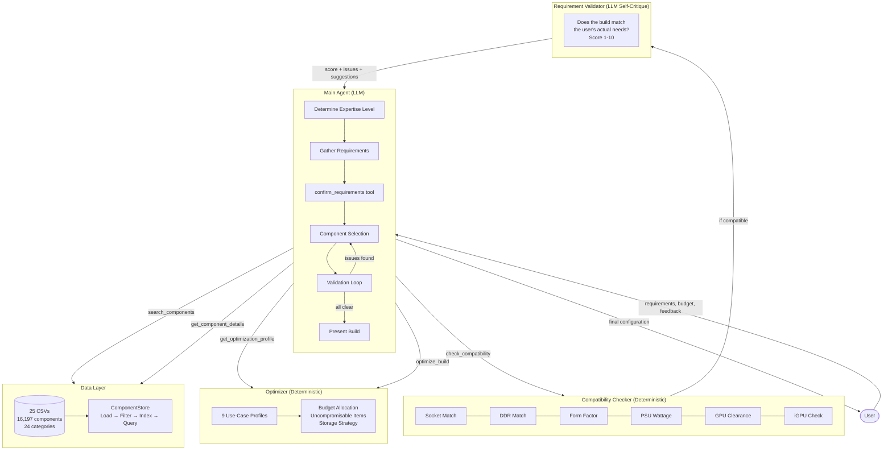

# Agent Run Report

## Architecture Diagram



## Full Agent Trace — Gaming PC $1500

Below is a real trace from a test run with `claude-sonnet-4-5-20250929`.

### Turn 1: User Message
```
User: "I want to build a gaming PC for about $1500. I play AAA games at 1440p. I prefer NVIDIA GPUs."
```

### Turn 1: Agent Response (Requirement Gathering)
```
Agent: "Perfect! I have your core requirements:
- Use case: Gaming (AAA titles at 1440p)
- Budget: $1500
- GPU preference: NVIDIA

Let me ask just a couple of quick follow-up questions:

1. Target frame rate: Are you aiming for 60 FPS on high settings, or do you want 100+ FPS?
2. Intel vs AMD CPU preference, or should I pick the best value?
3. Storage needs: Would 1TB NVMe SSD be enough, or do you need more?

I'll assume smooth 1440p at high/ultra settings if you'd like me to just proceed!"
```

### Turn 2: User Message
```
User: "Go with best value for everything. No OS needed in the budget. High settings at 1440p with good frame rates."
```

### Turns 3-30: Tool Calls (Agent Reasoning Chain)

| Turn | Tool | Input | Result |
|------|------|-------|--------|
| 3 | `confirm_requirements` | `{use_case: "gaming", budget: 1500, expertise_level: "intermediate", preferences: {gpu_brand: "NVIDIA", resolution: "1440p", needs_os: false}}` | Requirements confirmed |
| 4 | `get_optimization_profile` | `{use_case: "gaming", total_budget: 1500}` | GPU: $525 (35%), CPU: $300 (20%), Mobo: $150 (10%), RAM: $120 (8%), Storage: $120 (8%), PSU: $105, Case: $105, Cooler: $75. Uncompromisable: GPU, CPU, Monitor, Memory |
| 5 | `search_components` | `{category: "cpu", filters: {min_cores: 6, max_price: 320, min_price: 150}, sort_by: "price", limit: 15}` | Found 15 CPUs. Selected Intel Core i7-12700KF ($214, 12C, LGA1700, 125W TDP) |
| 6 | `search_components` | `{category: "motherboard", filters: {socket: "LGA1700", max_price: 170}}` | Found 15 boards. Selected MSI PRO B760M-P DDR4 ($107, LGA1700, mATX, DDR4, 4 slots) |
| 7 | `search_components` | `{category: "memory", filters: {ddr_generation: 4, min_total_gb: 32, max_modules: 2}}` | Found 15 kits. Selected PNY XLR8 32GB ($60, 2x16GB DDR4-3200, CL16) |
| 8 | `search_components` | `{category: "gpu", filters: {chipset_contains: "RTX 4070", max_price: 580}}` | Found RTX 4070 at $579. Selected PNY XLR8 Gaming VERTO EPIC-X RGB ($579, RTX 4070, 12GB, 200W) |
| 9 | `search_components` | `{category: "storage", filters: {storage_type: "NVMe SSD", min_capacity_gb: 1000, max_price: 90}}` | Found 15 drives. Selected Silicon Power UD90 2TB ($93, NVMe PCIe 4.0) |
| 10 | `search_components` | `{category: "cpu_cooler", filters: {cooler_type: "Air"}}` | Selected Thermalright Peerless Assassin ($38, air, 25.6 dBA) |
| 11 | `search_components` | `{category: "psu", filters: {min_wattage: 650, efficiency: "gold"}}` | Selected SAMA GT 750W ($75, Gold, Full modular) |
| 12 | `search_components` | `{category: "case", filters: {compatible_form_factor: "Micro ATX", min_gpu_length: 305}}` | Selected Zalman T3 PLUS ($40, mATX Mid Tower, 330mm GPU clearance) |
| 13 | `check_compatibility` | All 8 core components | **PASS**: 0 errors, 0 warnings, ~373W draw, $1154 total |
| 14 | `optimize_build` | `{use_case: "gaming", budget: 1500, current_build: {...}}` | 0 suggestions, $346 remaining budget |

### Compatibility Check Detail
```json
{
  "compatible": true,
  "errors": [],
  "warnings": [],
  "estimated_power_draw": 373,
  "recommended_psu_wattage": 500,
  "total_price": 1154.33
}
```

### Final Build Presented

| Component | Selection | Price | Key Spec |
|-----------|----------|-------|----------|
| CPU | Intel Core i7-12700KF | $214 | 12 cores, 5.0 GHz boost, LGA1700 |
| Motherboard | MSI PRO B760M-P DDR4 | $107 | LGA1700, mATX, DDR4, 4 DIMM slots |
| Memory | PNY XLR8 32 GB | $60 | 2x16GB DDR4-3200 CL16 |
| GPU | PNY XLR8 Gaming VERTO EPIC-X RGB | $579 | GeForce RTX 4070, 12GB GDDR6X |
| Storage | Silicon Power UD90 2TB | $93 | NVMe PCIe 4.0, M.2-2280 |
| CPU Cooler | Thermalright Peerless Assassin | $38 | Air cooler, 25.6 dBA |
| PSU | SAMA GT 750W | $75 | 80+ Gold, Full modular |
| Case | Zalman T3 PLUS | $40 | mATX Mid Tower, TG side panel |
| **Total** | | **$1,154** | **$346 under budget** |

### Agent Reasoning
- **GPU ($579, 38% of budget)**: Uncompromisable for gaming. RTX 4070 handles 1440p AAA at high settings with 80+ FPS. Allocated more than the suggested 35% because it's the #1 priority.
- **CPU ($214)**: i7-12700KF has 12 cores with 5.0 GHz boost — well matched to the RTX 4070 to avoid bottlenecking.
- **RAM ($60)**: 2x16GB in a 4-slot board leaves room to expand to 64GB. DDR4-3200 CL16 is the sweet spot for gaming.
- **Storage ($93)**: 2TB NVMe at $0.046/GB — enough for OS + large game library without a second drive.
- **Cooler ($38)**: Air cooler handles the 125W TDP easily. Quiet at 25.6 dBA.
- **PSU ($75)**: 750W Gold with 25%+ headroom over the ~373W draw. Future-proof for GPU upgrades.
- **Case ($40)**: Budget allocated to GPU instead of case aesthetics (compromisable item).

---

## Design Decisions & Trade-offs

### 1. Custom Agent Loop vs. Framework (LangChain/LangGraph)
**Decision**: Raw Anthropic SDK with a custom ~100-line agent loop.
**Why**: The agent pattern here is straightforward (conversation + tool calls). A framework would add abstraction without value. Every line of code is ours and inspectable.
**Trade-off**: No built-in memory persistence or graph visualization.

### 2. Deterministic Checks vs. LLM-Based Checks
**Decision**: Hybrid — socket/DDR/power checks are deterministic Python; "does it match user intent?" is LLM-based (RequirementValidator).
**Why**: Technical specs are factual — LLMs hallucinate on them. Intent matching requires reasoning — Python can't do it. Each layer does what it's best at.
**Trade-off**: The validator adds latency (extra LLM call) but catches mismatches the checker can't.

### 3. Expertise-Level Conversation Adaptation
**Decision**: Three tiers (newbie/intermediate/expert) that change the conversation depth.
**Why**: A newbie asking about "thermal paste brands" is confusion. An expert not being asked is frustration. The agent adapts to serve both.
**Trade-off**: More complex prompting, but better user experience.

### 4. Uncompromisable Items per Use Case
**Decision**: Each use-case profile defines components that should never be cheaped out on.
**Why**: A gaming PC with a weak GPU is pointless. An ML workstation with 8GB VRAM can't train anything. These are domain-specific hard constraints.
**Trade-off**: Limits budget flexibility, but prevents fundamentally flawed builds.

### 5. Data Enrichment (socket, DDR, TDP, storage type)
**Decision**: Pre-enriched CSVs with derived columns rather than runtime lookups.
**Why**: The raw dataset lacks critical fields (CPU socket, GPU TDP, motherboard DDR gen). Enriching at load time with verified data is more reliable than asking the LLM to infer them.
**Trade-off**: Requires maintenance if the dataset changes, but eliminates hallucination risk.

### 6. confirm_requirements Tool Gate
**Decision**: The agent must call `confirm_requirements` before any search tools are unblocked.
**Why**: Prevents the LLM from jumping to component search without gathering use case and budget. The LLM itself decides when it has enough info — no fragile regex parsing.
**Trade-off**: Adds one extra tool call, but guarantees the agent always asks before building.

### 7. All 25 Component Categories Searchable
**Decision**: Every CSV in the dataset is loaded and searchable — not just the 8 core components.
**Why**: A complete PC build includes peripherals (monitor, keyboard, mouse), networking (WiFi card), cooling (case fans, thermal paste), and accessories. The agent considers all of them.
**Trade-off**: Larger data footprint (~16K components), but comprehensive recommendations.
