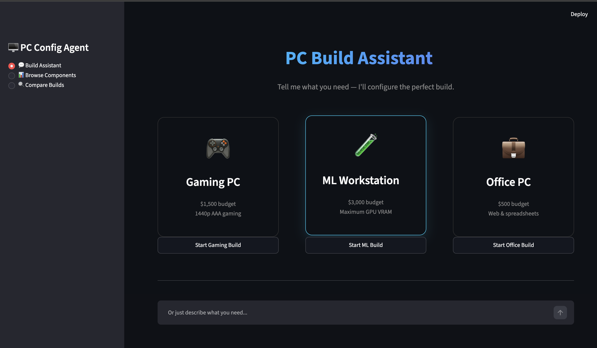
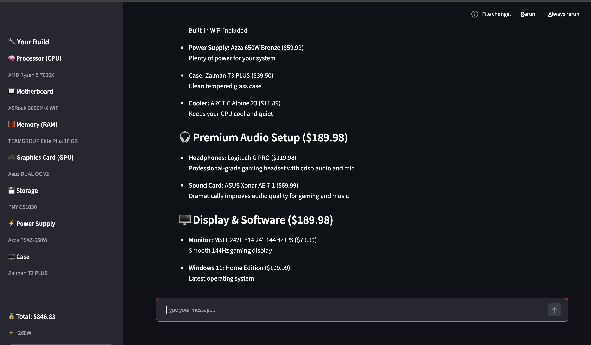
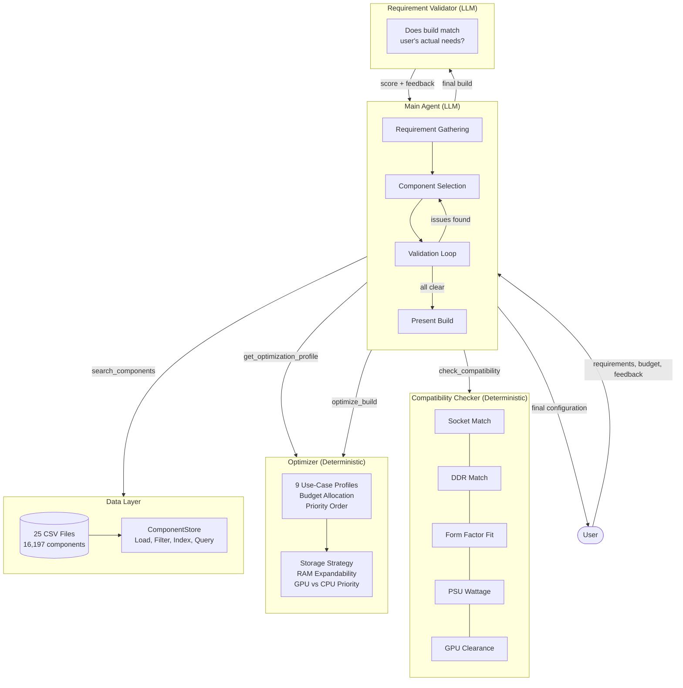

# PC Configuration Agent

An agentic AI system that helps users configure compatible, optimized PC builds based on their requirements, budget, and use case.

### Landing Page


### Build in Progress


## Quick Start

### Prerequisites
- An Anthropic API key ([get one here](https://console.anthropic.com/settings/keys))

### Option 1: Docker (recommended)

Works on **Linux, Windows, and macOS**.

```bash
git clone https://github.com/KalyanSekhar7/PC-builder-RAG.git
cd pc-config-agent

cp .env.example .env
# Edit .env and add your ANTHROPIC_API_KEY

docker compose up
# Opens at http://localhost:8501
```

Other modes:
```bash
docker compose run --rm cli     # Interactive CLI
docker compose run --rm eval    # Run evaluation suite
docker compose down             # Stop
```

### Option 2: Local

Requires Python 3.10+.

```bash
git clone https://github.com/KalyanSekhar7/PC-builder-RAG.git
cd pc-config-agent

python -m venv venv
source venv/bin/activate    # Linux/macOS
# venv\Scripts\activate     # Windows

pip install -e .

cp .env.example .env
# Edit .env and add your ANTHROPIC_API_KEY

streamlit run ui/app.py     # Streamlit UI at http://localhost:8501
python -m src.main          # or CLI mode
```

---

## Architecture



## How It Works

1. **Expertise Detection** — First asks if user is a beginner, intermediate, or expert, and adapts conversation depth accordingly
2. **Requirement Gathering** — Collects use case, budget, and preferences conversationally (1-2 questions per turn, not a form)
3. **Optimization Profile** — Dynamic budget allocation based on total budget and use case (floor-price-aware, uncompromisable items get priority)
4. **Component Selection** — Searches 16,197 components across 24 categories in dependency order: CPU → Motherboard → RAM → GPU → Storage → Cooler → PSU → Case → WiFi → Peripherals
5. **Compatibility Check** — 9 deterministic checks: socket, DDR, form factor, power, GPU clearance, iGPU, RAM slots, PSU headroom, cooler fit
6. **Requirement Validation** — A second LLM call (self-critique) validates: "does this build actually match what the user asked for?"
7. **Price Verification** — Mechanical check catches LLM arithmetic errors by comparing claimed totals against database values
8. **Feedback Loop** — User can request changes; agent adjusts only affected components and re-validates

## Design Decisions

### Why Raw SDK Instead of LangChain/LangGraph?
- The agent loop is ~100 lines. A framework adds abstraction without value here.
- Every line of code is ours — demonstrates understanding of how agents work.
- Full control over tool dispatch, trace logging, and error handling.
- Easier to debug and inspect the reasoning chain.

### Deterministic Checks vs. LLM Checks
- **Socket, DDR, form factor, power**: These are factual — LLMs hallucinate on technical specs. Python code is 100% reliable.
- **"Does this build match user intent?"**: This requires reasoning about ambiguous requirements. Perfect for an LLM.
- Result: hybrid approach where each layer does what it's best at.

### Expertise-Level Conversation Adaptation
- **Beginner**: 1-2 simple questions, agent makes all technical decisions, jargon-free
- **Intermediate**: covers core parts, offers to handle cooler/PSU/fans automatically
- **Expert**: 1-2 questions per turn, presents 2-3 options with pros/cons for every component

### Dynamic Budget Allocation
Static percentage splits fail at extreme budgets. Our floor-price-aware system:
- Reserves minimum viable price per component ($90 mobo, $30 storage, etc.)
- Distributes remaining budget by priority weights
- Uncompromisable items get 1.5x boost
- At $500: GPU gets 35% (floor prices eat the rest). At $5000: GPU gets 40% (more room to optimize)

### Price-Performance Value Scoring
Every component has a `value_score` property:
- CPU: `cores * boost_clock / price`
- GPU: `vram * boost_clock / price`
- Memory: `total_gb * speed / price`
- Storage: `capacity / price`

Searchable via `sort_by="value"` — finds best bang-for-buck, not just cheapest.

### Data Enrichment
The raw dataset lacked critical fields. We enriched it (see `data/added_readme.md`):
- **CPU socket**: derived from microarchitecture (33 mappings, all factual)
- **Motherboard DDR generation**: socket-based rules + 38 boards verified via internet
- **GPU TDP**: published manufacturer specs for ~190 chipsets
- **Storage type**: derived from type + interface fields
- **Case compatibility**: standard ATX form factor rules + GPU clearance estimates

### Mechanical Price Verification
LLMs are bad at arithmetic. After every response, a Python function:
- Extracts claimed build totals from the response text
- Compares against the actual `total_price` from `check_compatibility`
- Shows a warning if discrepancy > $10 (only for full build totals, ignores peripheral subtotals)

## Tools (6)

| Tool | Type | Purpose |
|------|------|---------|
| `confirm_requirements` | Flow control | Gates component search until use case + budget + expertise gathered |
| `search_components` | Database query | Search 24 categories with filters (price, socket, DDR, VRAM, etc.) |
| `get_optimization_profile` | Deterministic | Dynamic budget allocation + priorities + uncompromisable items |
| `check_compatibility` | Deterministic | 9 compatibility checks + power draw + total price |
| `optimize_build` | Deterministic | Analyze build for improvements |
| `get_component_details` | Database query | Full specs for a specific component |

## Evaluation

### Test Scenarios

5 scenarios covering different use cases and constraints:

| Scenario | Use Case | Budget | Key Constraints |
|----------|----------|--------|-----------------|
| Mid-range Gaming | Gaming | $1,500 | 1440p, NVIDIA GPU |
| ML Workstation | ML Training | $3,000 | 64GB RAM, max VRAM |
| Budget Office | Office | $500 | No gaming, iGPU ok |
| 4K Video Editing | Content Creation | $2,500 | AMD CPU, 64GB RAM |
| Compact ITX Gaming | Gaming | $2,000 | Mini ITX, air cooling only |

### RAGAS-Style Metrics (4 layers)

| Layer | Metrics | What It Measures |
|-------|---------|-----------------|
| Retrieval | Precision@K, MRR, NDCG@K, Hit Rate | Did we find the right components? |
| Generation | Faithfulness, Answer Relevancy (LLM judge) | Are claims grounded? Does the build match? |
| Agent | Tool Call Accuracy, Tool Call F1, Goal Accuracy | Right tools? Achieved the goal? |
| Domain | Compatibility, Budget Adherence, Uncompromisable Compliance | PC-build-specific quality |

```bash
# Run evaluation
python evaluation/run_eval.py

# Run full metrics test (requires API key)
python evaluation/run_metrics_test.py
```

## Error Handling

- **LLM API failures**: Exponential backoff retry (3 attempts)
- **Tool execution errors**: Caught and returned to LLM as error messages (agent adapts)
- **Component not found**: Fuzzy name matching, graceful error with suggestions
- **Budget impossible**: Agent explains why and suggests minimum viable budget
- **Malformed CSV data**: Rows with missing/invalid data are skipped during loading
- **Input validation**: All tool inputs validated via Pydantic schemas + confirm_requirements gate
- **Price hallucination**: Mechanical verifier catches LLM arithmetic errors post-response

## Logging

Every agent step is logged for full trace inspection:
```
15:30:01 [agent.loop] INFO: --- Agent turn 1 ---
15:30:03 [agent.tools] INFO: Tool call: search_components({"category": "cpu", ...})
15:30:03 [engine.compatibility] INFO: Compatibility check: PASS | 0 errors, 1 warnings
15:30:04 [engine.validator] INFO: Validation result: score=8/10, satisfies=True
```

Traces are saved as JSON to `evaluation/reports/` for post-hoc analysis.

## Streamlit UI

The UI has 3 pages:
- **Build Assistant** — Chat with the AI agent (landing page with quick-start cards, full-width chat with live thinking indicator, build summary in sidebar)
- **Browse Components** — Explore all 24 categories with filters and specs
- **Compare Builds** — Side-by-side build comparison with pros/cons and optional peripherals

```bash
# Local
streamlit run ui/app.py

# Docker
docker compose up
# Opens at http://localhost:8501
```
